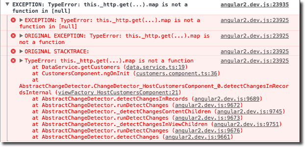

<style type="text/css">
.reveal pre code {
    display: block;
    padding: 5px;
    overflow: auto;
    max-height: 900px;
    word-wrap: normal;
}
</style>

## Angular Tips & Tricks

<br>
<small>by Peter Cosemans </small>

---

# mjr

https://github.com/mjrio/mjr-frontend-angular-tips

---

# Documentation & Libraries
> You never have enough info

----

## Documentation & Libraries
<br><br><br>
The unofficial Angular Docs.

### http://ngdoc.io/

> A tagged collection of Angular articles.

----

## Documentation & Libraries
<br><br><br>
Angular 2+ (and others) components & libraries.

### https://devarchy.com/angular

----

## Documentation & Libraries
<br><br><br>
Rangle's Angular Training Book

### https://www.gitbook.com/book/rangle-io/ngcourse2

----

## It’s angular

AngularJS is 1.x
Angular is 2+ (so also 4, 5, 6)

Angular 4,x has Long Term Support (LTS) until October 2018
Angular 5 will be released in 18 Sept 2017
Angular 6 - March 2018
Angular 7 - October 2018

[angular/RELEASE_SCHEDULE.md at master · angular/angular · GitHub](https://github.com/angular/angular/blob/master/docs/RELEASE_SCHEDULE.md)

---

# Tooling
> A good tool is half the job

----

<image src="./images/prettier.png"><image>

Prettier is an opinionated code formatter. It format this

```js
foo(reallyLongArg(), omgSoManyParameters(), IShouldRefactorThis(), isThereSeriouslyAnotherOne());
```

to

```js
foo(
  reallyLongArg(),
  omgSoManyParameters(),
  IShouldRefactorThis(),
  isThereSeriouslyAnotherOne()
);
```

Resources

- [Prettier Official WebSite](https://prettier.io/)
- [VSCode Plugin](https://marketplace.visualstudio.com/items?itemName=remimarsal.prettier-now)

----

## Prettier

VSCode user settings

```
{
  "editor.formatOnSave": true,
}
```

.prettierrc

```json
{
  "trailingComma": "all",
  "singleQuote": true,
  "tabWidth": 2,
  "printWidth": 80,
  "useTabs": false,
  "semi": true
}
```

----

## Script everything

package.json

```json
"scripts": {
    "ng": "ng",
    "serve": "ng serve --hmr --open",
    "serve:simple": "ng serve",
    "build": "npm run setVersion && ng build --stats-json",
    "build:prod": "npm run setVersion && ng build --target=production --environment=prod --output-path=dist-prod --stats-json",
    "build:prod:sourcemaps": "npm run build:prod -- --sourcemap",
    "test": "jest --watch",
    "test:ci": "jest",
    "lint": "ng lint --type-check --format=stylish",
    "cleanup": "rimraf dist* yarn-error.log",
    "explore": "webpack-bundle-analyzer dist/stats.json",
    "setVersion": "node ./scripts/setVersion.js",
    "format": "prettier --parser typescript --write './src/**/*.{ts,scss,json}'"
},
```

Add script files when needed

```
./scripts
  setVersion.js
  deploy.js
```

> Say goodbye to grunt and gulp

----

## Npx

Run without script element in package.json

```
npx jest help
```

You can run modules/scripts without install

```
npx serve
npx https://gist.github.com/zkat/4bc19503fe9e9309e2bfaa2c58074d32
npx reveal-md slides.md
npx cowsay TypeScript is cool!
```

> You need node 8.x or higher

----

## Cool npm utilities

live-server

```bash
# run http server with live reload, history mode, etc...
$ live-server --entry-file=index.html .
```

json-server

```bash
# run API server (support GET, POST, PUT, DELETE)
$ json-server ./user.json
```

types-checker

```bash
# install all missing typings files
$ yarn add config
$ types-checker --all
Starting types-checker@0.0.7
These modules are missing @types/config @types/node
Running yarn add --dev @types/config @types/node
Done in 9.09s
```

rimraf

```bash
# recursive delete files
$ rimraf ./node_modules
```

---

# AngularCLI
> Less known but powerfull options

----

## Mot Module Replacement

```bash
# startup development server with HMR
$ ng serve --hmr
```

Hot modules replacement is not enabled by default in Angular-CLI

```bash
$ ng serve --hmr
NOTICE Hot Module Replacement (HMR) is enabled the dev server
  The project will still live reload when HMR is enabled,
  but to take advantage of HMR additional application code is required
  (not included in an Angular CLI project by default).
  See https://webpack.github.io/docs/hot-module-replacement.html for
  information on working with HMR Webpack
** NG Live Development Server is listening on localhost:4200, open your browser on http://localhost:4200 **
```

environments.ts

```ts
export const environment = {
    hmr: true,      // disable this in production
}
```

----

## Build stats & bundle size

```bash
# Install bundle analyser
$ yarn add webpack-bundle-analyzer --dev

# Build with statistics
ng build --stats-json

# Start analyser
npx webpack-bundle-analyzer dist/stats.json
```

</img>

----

## Direct Access to CSS during serve

```bash
ng serve --extract-css
```


---

# Typescript
> I can do more then you think

----

## Global variables

```js
// Extra variables that live on Global that
// will be replaced by webpack DefinePlugin
declare var ENV: string;
declare var HMR: boolean;

// Any global declarations
declare var $: any;

// support NodeJS modules without type definitions
declare module 'my-awesome-lib';
declare module '*';

interface ErrorStackTraceLimit {
  stackTraceLimit: number;
}

interface GlobalEnvironment {
  ENV: string;
  HMR: boolean;
}

interface Global extends GlobalEnvironment  {}
```

----

## Absolute imports

TypeScript supports absolute imports. The preset by default understands all absolute imports referring to src directory, so instead:

```
import MyComponent from '../../src/app/my.component';
import MyStuff from '../../src/testing/my.stuff';
```

you can use:

```
import MyComponent from 'app/my.component';
import MyStuff from 'testing/my.stuff';
```

See also [Module Resolution](https://www.typescriptlang.org/docs/handbook/module-resolution.html)

----

## Imports json

```ts
// ES6/ES2015
import * as data from './example.json';
const word = data.name;
```

In Typescript, however, the same code will throw error:

    Cannot find module 'example.json'

Solution: Wildcard module name

```ts
declare module "*.json" {
    const value: any;
    export default value;
}
```

Be aware all json is of type: any

---

# Clean Angular Code
> Write it the good way

----

## Typesafe http calls

With interface

```js
interface IUser {
    name: string,
    role: string,
}

export class ProductService {
    constructor(private http: Http) {}

    get() : Observable<IUser[]> {
        return this.http.get(`/api/users`)
            .map(res => res.json())
    }
}
```

With class

```js
export class User {
    constructor(data: any) {
        Object.assign(this, data)
    }
}

export class UserService {
    constructor(private http: Http) {}

    getAll() : Observable<User[]> {
        return this.http.get(`/api/users`)
            .map(res => res.json())
            .map(data => data.map(dto => new User(dto)))
    }
}
```

----

## HttpClientModule

- No more res.json()
- Http interceptors are back
- Easier unit testing !!!!!

```js
interface IUserDto {
    name: string,
    role: string,
}

export class UserService {
    constructor(private httpClient: HttpClient) {}

    getAll() : Observable<User[]> {
        return this.httpClient.get<IUserDto[]>(`/api/users`)
            .map(data => data.map(dto => new User(dto)))
    }
}
```

----

## Access the dom

```js
@Component({ ... })
export class HeroComponent {
    constructor(private _elementRef: ElementRef) {}

    doBadThings() {
        $('.bad-with-jquery').click();
        this._elementRef.nativeElement.xyz = 'bad with native element';
        document.getElementById('bad-with-document');
    }
}
```

Better

```js
@Component({ ... })
export class HeroComponent {
    // use Renderer for Angular2, Renderer2 for Angular4+
    constructor(private _renderer: Renderer2,
                private _elementRef: ElementRef) {}

    doGoodThings() {
        this._renderer
            .setElementProperty(this._elementRef,
                                'some-property', true);
    }
}
```

----

## Access the dom events

```js
@Directive({
  selector: `[appHighlight]`
})
export class HighlightDirective {
  constructor(private el: ElementRef, private renderer: Renderer2) { }

  @HostListener('click', ['$event'])
  onClick() {
    ...
  }

  @HostListener('document:click', ['$event'])
  onDocumentClick(event: Event) {
    if (this.el.nativeElement.contains(event.target)) {
      this.highlight('yellow');
    } else {
      this.highlight(null);
    }
  }

  highlight(color) {
    this.renderer.setElementStyle(this.el.nativeElement, 'backgroundColor', color);
  }
}
```

----

## Dynamic base ref

When the app is hosted after a reverse proxy

```
http://server.com/myApp
```

Dynamic base href

```js
import { APP_BASE_HREF } from '@angular/common';
import { NgModule } from '@angular/core';

@NgModule({
    providers: [
        {
            provide: APP_BASE_HREF,
            useValue: '/' + (window.location.pathname.split('/')[1] || '')
        }
    ]
})
export class AppModule { }
```

----

## Avoid magic strings

Don't

```html
<message [type]="error">Hello</message>
```

Do use enum (and we have auto complete in the template)

```js
export enum MessageTypes {
  Default,
  Success,
  Error,
  Warning
}

export class AppComponent {
  messageTypes = MessageTypes;
  constructor() { }
}

```
```html
<message [type]="messageTypes.Error">Hello</message>
```

----

## Template of reactive form

Always go for a Reactive Form

* Unit testable (validation is performed in code)
* Easier to write custom validator
* RxJS powered

TODO: add sample

----

## Don't place logic in your templates

Don't

```html
<div [formGroup]="form"
     [ngClass]="{
        'has-error': (form.controls['firstName'].invalid &&
            (submitted || form.controls['firstName'].touched))
        }">
    <input type="text" formControlName="firstName"/>
</div>
```

Do

```html
<div [formGroup]="form"
     [ngClass]="{'has-error': hasFieldError('firstName')}">
   <input type="text" formControlName="firstName"/>
</div>
```

```ts
hasFieldError(fieldName: string): boolean {
  return this.form.controls[fieldName].invalid &&
        (this.submitted || this.form.controls[fieldName].touched);
}
```

----

## Details should go in sub components

Whenever you write an **ngFor** directive on an HTML element with children, consider separating that element into a dependent component, like this:

```html
<div *ngFor="let user of users">
  <h3 class="user_wrapper">{{user.name}}</h3>
  <span class="user_info">{{ user.age }}</span>
  <span class="user_info">{{ user.dateOfBirth | date : 'YYYY-MM-DD' }}</span>
</div>
```

Better

```html
<user-details *ngFor="let user of users" [user]="user"></user-details>
```

---

# Debugging
> There is more then console.log

----

## Augury

Augury helps Angular 2.0 developers visualize the application through component trees, and visual debugging tools.

----

## Angular Language Service

----

## Source Maps & Debugger

Open web developer console, go to "Sources" section. Press "cntrl+p". A search box will open where type ".ts" and find your file or directly search your file like "myfile.ts".

----

## Debug in vscode

Create launch config file

```json
// .vscode/launch.json
{
    "version": "0.2.0",
    "configurations": [
        {
            "name": "Launch Chrome against localhost, with sourcemaps",
            "type": "chrome",
            "request": "launch",
            "url": "http://localhost:3000",
            "sourceMaps": true,
            "webRoot": "${workspaceRoot}/build"
        },
        {
            "name": "Attach to Chrome, with sourcemaps",
            "type": "chrome",
            "request": "attach",
            "port": 9222,
            "sourceMaps": true,
            "webRoot": "${workspaceRoot}/build"
        }
    ]
}
```

Installing the Debugger for Chrome vscode extension

Start chrome via VSCode

---

# RxJS
> Be reactive in a good way

----

## RxJS operators

The problem



Don’t do this

```js
import {Observable} from 'rxjs';
```

Do this

```js
import 'rxjs/add/operator/map';
import 'rxjs/add/operator/catch';
```

----

## RxJS operators helper

src/app/shared/rxjs-operators.ts

```js
// Observable class extensions
import 'rxjs/add/observable/of';

// Observable operators
import 'rxjs/add/operator/map';
import 'rxjs/add/operator/do';
import 'rxjs/add/operator/catch';
import 'rxjs/add/operator/switchMap';
import 'rxjs/add/operator/mergeMap';
import 'rxjs/add/operator/filter';
import 'rxjs/add/operator/debounceTime';
import 'rxjs/add/operator/distinctUntilChanged';
```

app.module.ts

```js
import './rxjs-operators';

@NgModule({
  ...
})
```

test.setup.ts

```js
import './rxjs-operators';
```

----

## Debug RxJS

```js
import { Observable } from "rxjs";

const debuggerOn = true;

Observable.prototype.debug = function (message: string) {
    return this.do(
        function (next) {
            if (debuggerOn) {
                console.log(message, next);
            }
        },
        function (err) {
            if (debuggerOn) {
                console.error('ERROR >>> ',message , err);
            }
        },
        function () {
            if (debuggerOn) {
                console.log('Completed.');
            }
        }
    );
};
```

Use

```js
this.myService.findById(objectId)
      .debug("Loading data from backend")
      .subscribe(...)
```

----

## A simple cache

```ts
getUsers() {
    if (this.localCache) {
        return Observable.of(this.localCache)
    }
    return this.http.get('/api/users')
        .map(res => res.json())
        .startWith(this.localCache)
        .do(data => this.localCache = data)
}
```

----

## Better cache example

```js
export class FriendsService {
    friends: Observable<IFriend[]> = null;
    constructor(private http: Http) {}

    getFriends() : Observable<IFriend[]> {
        if(!this.friends){
            this.friends = this.http.get('./api/friends')
               .map(res => res.json().friends)
               .publishReplay(1, 30000)
               .refCount();
        }
        return this.friends;
    }
    clearCache(){
        this.friends = null;
    }
}
```

in RxJS 5.4

```js
this.friends = this.http.get('./api/friends')
               .map(res => res.json().friends)
               .shareReplay(1);
```
----

## Http Retry & Timeout

A basic retry with timeout

```js
getUsers(): Observable<User[]> {
  return this.http.get('api/users')
      .retry(3)
      .timeout(2000, new Error('timeout exceeded'))
      .map(res => res.map())
}
```

----

## Improve Retry and timeout

A more full complete retry

```js
http.get('api/users')
    .map(res => res.json())
    .let(handleRetryAndTimeout(2, 500, 2000))
    .catch(error => castError(error))

function handleRetryAndTimeout(retry, retryTime, timeout) {
    return (obs) => {
      return obs.timeout(timeout)
        .retryWhen(errors => {
          return errors
            .scan((retryCount, err) => {
              // only retry on socket error, not on http error
              if (!err.status && retryCount < retry) {
                return retryCount + 1;
              }
              throw err;
            }, 0)
            .delay(retryTime);
        })
        .catch(castError);
    }
}
```

----

## Unsubscribe

Forms

```js
export class TestComponent {

  ngOnInit() {
    this.form = new FormGroup({...});
    this.valueChanges  = this.form.valueChanges.subscribe(console.log);
    this.statusChanges = this.form.statusChanges.subscribe(console.log);
  }

  ngOnDestroy() {
    this.valueChanges.unsubscribe();
    this.statusChanges.unsubscribe();
  }
}
```

Router

```js
export class TestComponent {
  constructor(private route: ActivatedRoute, private router: Router) { }

  ngOnInit() {
    this.route.params.subscribe(console.log);
    this.route.queryParams.subscribe(console.log);
    this.route.fragment.subscribe(console.log);
    this.route.data.subscribe(console.log);
    this.route.url.subscribe(console.log);

    this.router.events.subscribe(console.log);
  }

  ngOnDestroy() {
    // You should unsubscribe from each observable here
  }
}
```

----

## Unsubscribe

infinite streams

```js
export class TestComponent {

  constructor(private element : ElementRef) { }

  interval: Subscription;
  click: Subscription;

  ngOnInit() {
    this.interval = Observable.interval(1000).subscribe(console.log);
    this.click = Observable.fromEvent(this.element.nativeElement, 'click').subscribe(console.log);
  }

  ngOnDestroy() {
    this.interval.unsubscribe();
    this.click.unsubscribe();
  }

}
```

Redux store

```js
export class TestComponent {

  constructor(private store: Store) { }
  todos: Subscription;

  ngOnInit() {
     this.todos = this.store.select('todos').subscribe(console.log);
  }

  ngOnDestroy() {
    this.todos.unsubscribe();
  }
}
```

----

## Unsubscribe

Auto destroy

```js
export class TestComponent {

  constructor(private store: Store) { }
  private componetDestroyed: Subject = new Subject();
  ngOnInit() {
     this.store.select('todos')
         .takeUntil(this.componetDestroyed)
         .subscribe(console.log);

     this.store.select('posts')
         .takeUntil(this.componetDestroyed)
         .subscribe(console.log);
  }

  ngOnDestroy() {
    this.componetDestroyed.next();
    this.componetDestroyed.unsubscribe();
  }
}
```

---

# Dependency Injection
> You can inject everything

----

## Singleton vs new instance

Singleton for the whole app

```ts
@NgModule({
    imports: [ ... ],
    declarations: [ ... ],
    providers: [ MyService ]
})
```

New instance when component is created

```ts
@Component({
  selector: 'hero',
  template: '...',
  providers: [ MyService ]
})
export class MyComponent {
  constructor(@Optional() @Self() private myService: MyService) {}
}
```

See also: [Exploring the Various Decorators in Angular](Exploring the Various Decorators in Angular)

---

# Unit Testing
> Delightfull unit testing

----

## PhantomJS vs Chrome

PhantomJS is a slow, outdated browser. Don't use it anymore.

Now you can start Chrome headless (available from Chrome >= 59)

```bash
$ yarn add karma-chrome-launcher --dev
```

karma.config.js

```js
module.exports = function(config) {
    config.set({
        ...
        browsers: ['ChromeHeadless'],
    })
}
```

----

## Jest

> Don't use Karma/Jasmine

Jest is:

* Easier to use
* Fast (parallel, jsDom)
* Gives Instant Feedback
* Has Powerful mocking
* Has snapshot testing (easy component testing)

----

## Fast http testing

This is slow :(

```js
beforeEach(() => {
    TestBed.configureTestingModule({
        providers: [MyService],
        imports: [HttpClientTestingModule],
    });
})

test('getModels', () => {
    engine.getModels().subscribe(models => {
      expect(models.length).toBe(2);
      expect(models[0]).toEqual('aaaaa');
    });

    const req = httpMock.expectOne('api/models');
    expect(req.request.method).toEqual('GET');

    req.flush(['aaaaa', 'bbbbb']);
});

```

Simple mocking is x10 faster then TestBed testing

```js
test('getModels', async(() => {
    const resource = [{ id: 123, title: 'abc' }, { id: 333, title: 'abc' }];
    const httpClient = {
        get: jest.fn().mockImplementation(() => {
            return Observable.of(resource);
        }),
    };
    const service = new MyService(httpClient as any);

    expect.assertions(3);
    service.getModels().subscribe(models => {
        const url = httpClient.get.mock.calls[0][0];
        expect(url).toEqual('api/models');
        expect(models).toBeDefined();
        expect(models[0].id).toEqual(123);
    });
}));
```

---

# Date Pipe

```html
<span>{{today | date: 'dd/MM/yyyy'}}</span>
<span>{{today | date: 'shortDate'}}</span>
```

Predefined formats

* ‘medium’
* ‘short’
* ‘longDate’
* ‘mediumDate’
* ‘mediumTime’
* ‘shortTime’

It's US format, but we can change this

```
providers: [
    {
        provide: LOCALE_ID,
        useValue: 'en-US'
    }
]
```

----

# Date Pipe

Better to create custom date pipe

```js
@Pipe({
  name: 'dateFormat'
})
export class DateFormatPipe extends DatePipe implements PipeTransform {
  transform(value: any, args?: any): any {
    return super.transform(value, 'dd/MMM/yyyy');
  }
}
```

```html
<span>{{today | dateFormat}}</span>
```

Alternative

```js
@Pipe({
  name: 'dateFormat'
})
export class DateFormatPipe implements PipeTransform {
  transform(value: any, args?: any): any {
    const datePipe = new DatePipe('en');
    return datePipe.transform(value, 'dd/MMM/yyyy');
  }
}
```

---

# Resources

- [A Very Simple Way to Debug RxJs Code](http://blog.angular-university.io/debug-rxjs/)
- [Unit testing Angular applications with Jest](https://izifortune.com/unit-testing-angular-applications-with-jest/)


